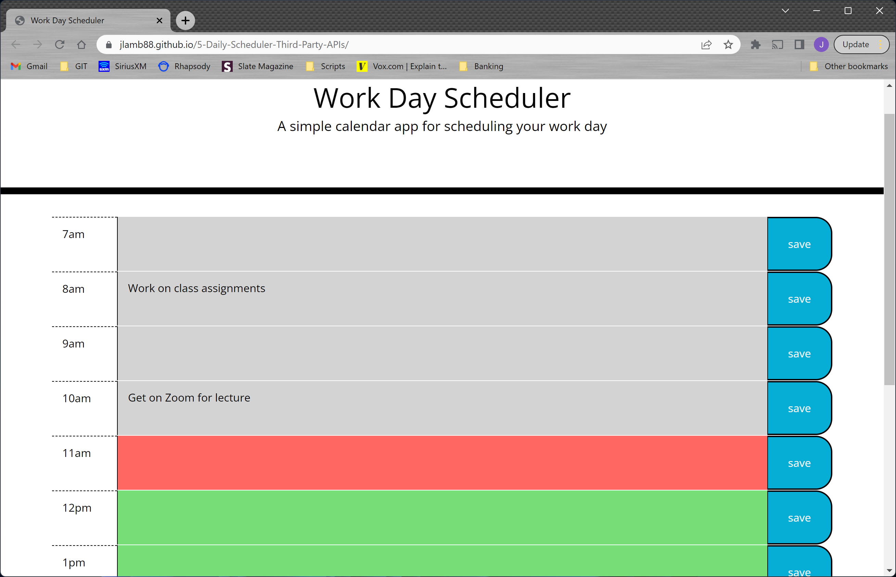

# 5-Daily Scheduler - Third-party APIs

## Description

I wish to create a simple calendar application that allows a user to save events for each hour of the day by modifying starter code. This app will run in the browser and feature dynamically updated HTML and CSS powered by jQuery.

## User Story

AS AN employee with a busy schedule<br>
I WANT to add important events to a daily planner<br>
SO THAT I can manage my time effectively<br>

## Acceptance Criteria

GIVEN I am using a daily planner to create a schedule<br>
WHEN I open the planner<br>
THEN the current day is displayed at the top of the calendar<br>
WHEN I scroll down<br>
THEN I am presented with timeblocks for standard business hours<br>
WHEN I view the timeblocks for that day<br>
THEN each timeblock is color coded to indicate whether it is in the past, present, or future<br>
WHEN I click into a timeblock<br>
THEN I can enter an event<br>
WHEN I click the save button for that timeblock<br>
THEN the text for that event is saved in local storage<br>
WHEN I refresh the page<br>
THEN the saved events persist<br>

## Installation

GitHub:

URL:

## Usage

Provide instructions and examples for use. Include screenshots as needed.

To add a screenshot, create an `assets/images` folder in your repository and upload your screenshot to it. Then, using the relative filepath, add it to your README using the following syntax:

    ```md
    
    ```

## Credits

List your collaborators, if any, with links to their GitHub profiles.

If you used any third-party assets that require attribution, list the creators with links to their primary web presence in this section.

If you followed tutorials, include links to those here as well.

## License

The last section of a high-quality README file is the license. This lets other developers know what they can and cannot do with your project. If you need help choosing a license, refer to [https://choosealicense.com/](https://choosealicense.com/).

---

🏆 The previous sections are the bare minimum, and your project will ultimately determine the content of this document. You might also want to consider adding the following sections.

## Badges


Badges aren't necessary, per se, but they demonstrate street cred. Badges let other developers know that you know what you're doing. Check out the badges hosted by [shields.io](https://shields.io/). You may not understand what they all represent now, but you will in time.

## Features

If your project has a lot of features, list them here.

## How to Contribute

If you created an application or package and would like other developers to contribute it, you can include guidelines for how to do so. The [Contributor Covenant](https://www.contributor-covenant.org/) is an industry standard, but you can always write your own if you'd prefer.

## Tests

Go the extra mile and write tests for your application. Then provide examples on how to run them here.